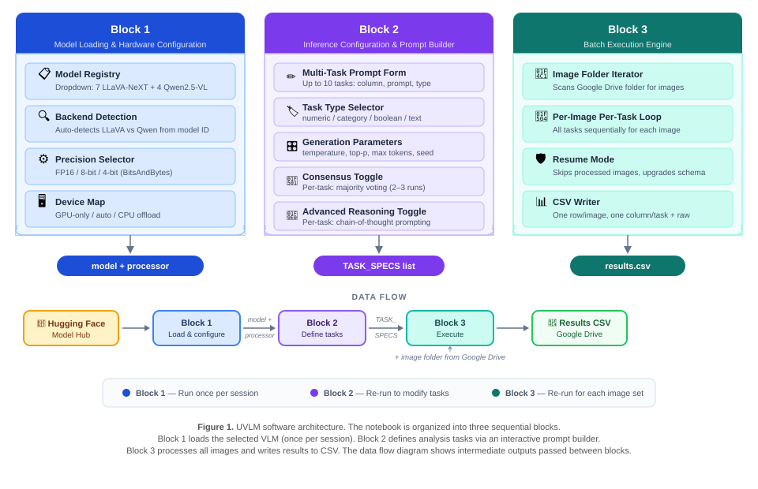

# UVLM: Unified Vision-Language Model Loader

[](LICENSE)
[](https://github.com/perezjoan/UVLM/releases)
[](https://doi.org/10.5281/zenodo.21975878)
[](https://github.com/perezjoan/UVLM)
[](https://colab.research.google.com/)
[](https://www.python.org/)

**UVLM** is an open-source Python package for **reproducible benchmarking of Vision-Language Models (VLMs)**. It provides a unified interface for loading, configuring, and evaluating multiple VLM architectures on custom image analysis tasks — without writing model-specific inference code.

UVLM currently supports five major model families — **LLaVA-NeXT**, **Qwen2.5-VL**, **Qwen3-VL**, **InternVL3.5**, and **Gemma 4** — which differ in their vision encoding, tokenization, and decoding strategies. The framework abstracts these differences behind a single inference function, enabling researchers to compare models using **identical prompts and evaluation protocols**.

💡 **Unified. Reproducible. Accessible.**

---

## 🧠 What does UVLM do?

UVLM combines model loading, prompt engineering, and batch evaluation into a modular Python package with interactive notebook interfaces:

- ✅ **24 VLM checkpoints** — 7 LLaVA-NeXT + 4 Qwen2.5-VL + 4 Qwen3-VL + 6 InternVL3.5 + 3 Gemma 4 models, from 1B to 110B parameters
- 🔧 **Multi-backend abstraction** — automatically routes inference to the correct pipeline (LLaVA-NeXT, Qwen2.5-VL, Qwen3-VL, InternVL3.5, or Gemma 4)
- 🗂️ **Family-based model selection** — notebook widgets let you pick the model family first, then the checkpoint
- 📝 **Multi-task prompt builder** — configure up to 10 analysis tasks per run with a widget-based UI
- 🔁 **Consensus validation** — majority voting across 2–5 repeated inferences for improved reliability
- 🧠 **Flexible reasoning support** — adjustable token budget (up to 1,500) for custom chain-of-thought prompts, plus a built-in CoT reference mode for benchmarking
- 🚨 **Truncation detection** — exact token counting flags responses that hit the generation limit, with per-task CSV diagnostics
- 📊 **Batch execution** — process entire image folders with resume capability and CSV output
- ⚡ **Quantization support** — FP16, 8-bit, and 4-bit precision via BitsAndBytes

---

## 🚀 Installation

### Google Colab (zero install)

Open the Colab notebook — it installs UVLM automatically:

[](https://colab.research.google.com/github/perezjoan/UVLM/blob/main/notebooks/UVLM_colab.ipynb)

### Local Installation

```bash
pip install git+https://github.com/perezjoan/UVLM.git
```

> ⚠️ **Breaking change in v4**: UVLM 4.x requires `transformers >= 5.15`. If your environment must stay on transformers 4.x, install the last 3.x release instead: `pip install git+https://github.com/perezjoan/UVLM.git@v3.2.0`

**Note**: PyTorch with CUDA must be installed separately to match your GPU driver. For example, with CUDA 12.8+:

```bash
pip install torch torchvision --index-url https://download.pytorch.org/whl/cu128
pip install git+https://github.com/perezjoan/UVLM.git
```
## 💻 Hardware Requirements

UVLM requires an NVIDIA GPU with CUDA support. Approximate VRAM requirements with 4-bit quantization:

| Model size | VRAM (4-bit) | Example GPUs |
|------------|-------------|--------------|
| 1–2B | ~1–2 GB | T4, RTX 3050 |
| 3–4B | ~3 GB | T4, RTX 3060 |
| 7–8B | ~5 GB | T4, RTX 4060 |
| 13B | ~8 GB | L4, RTX 4070 |
| 32–34B | ~20 GB | A100, RTX 4090 |
| 72B+ | ~40 GB+ | Multi-GPU required |

Tested on: Google Colab (T4, L4, A100), Windows 11 (RTX 5060).

---

## 🧪 Minimal Reproducible Example

Requires Python ≥3.9 and an NVIDIA GPU. From a clean environment:

```bash
conda create -n uvlm python=3.11 -y
conda activate uvlm
pip install torch torchvision --index-url https://download.pytorch.org/whl/cu128
pip install git+https://github.com/perezjoan/UVLM.git
```

```python
import requests
from uvlm import load_model, run_inference, parse_response

# Download sample image from this repository
url = "https://raw.githubusercontent.com/perezjoan/UVLM/main/D09.jpg"
open("D09.jpg", "wb").write(requests.get(url).content)

# Load model, run inference, parse result
ctx = load_model("[Qwen]  Qwen2.5-VL 3B Instruct", precision="4bit")
raw, tokens = run_inference("D09.jpg", "Count the motor vehicles in the image. Answer with only one integer number, nothing else.", ctx)
result = parse_response(raw, "numeric")
print(f"Result: {result}, Tokens generated: {tokens}")
```

Expected output: `Result: 2, Tokens generated: 2`

## 📐 Usage

### Google Colab

1. Open the Colab notebook (link above)
2. Select a GPU runtime: `Runtime` → `Change runtime type` → `T4 GPU`
3. **Run Block 1**: Select a model family, then a model; choose a precision mode (4-bit recommended), click "Load model"
4. **Run Block 2**: Define your analysis tasks using the prompt builder form
5. **Run Block 3**: Point to an image folder on Google Drive and execute — results are saved as CSV

### Local Jupyter Notebook

```bash
jupyter notebook notebooks/UVLM_local.ipynb
```

Same three-block workflow, but images are read from local folders instead of Google Drive.

### Python Script (advanced)

```python
from uvlm import load_model, run_inference, parse_response

ctx = load_model("[Qwen]  Qwen2.5-VL 7B Instruct", precision="4bit")
raw, tokens = run_inference("photo.jpg", "Count the cars", ctx)
result = parse_response(raw, "numeric")
print(result)
```

> ⚠️ **Hugging Face token**: Some models (e.g., LLaMA3-based) require authentication. Set the `HF_TOKEN` environment variable or run `huggingface-cli login` before use.

---

## 📐 Architecture

UVLM is organized as a modular Python package with interactive notebook interfaces:

<p align="center">
  
</p>

### Package Modules

| Module | Description |
|--------|-------------|
| `uvlm/loader.py` | Model loading with quantization and device placement |
| `uvlm/inference.py` | Multi-backend inference (LLaVA, Qwen2.5-VL, Qwen3-VL, InternVL3.5, and Gemma 4 pipelines) |
| `uvlm/parsers.py` | Response parsing for all four task types |
| `uvlm/consensus.py` | Consensus validation with majority voting |
| `uvlm/batch.py` | Batch execution engine with resume and schema upgrade |
| `uvlm/prompts.py` | Prompt assembly and reasoning templates |
| `uvlm/registry.py` | Model registry (24 checkpoints across 5 families) |
| `uvlm/utils.py` | Seed management, environment detection, token retrieval |

### Supported Models

| Family | Model | Parameters | Checkpoint ID |
|--------|-------|------------|---------------|
| **LLaVA-NeXT** | Mistral 7B | 7B | `llava-hf/llava-v1.6-mistral-7b-hf` |
| | Vicuna 7B | 7B | `llava-hf/llava-v1.6-vicuna-7b-hf` |
| | Vicuna 13B | 13B | `llava-hf/llava-v1.6-vicuna-13b-hf` |
| | 34B | 34B | `llava-hf/llava-v1.6-34b-hf` |
| | LLaMA3 8B | 8B | `llava-hf/llama3-llava-next-8b-hf` |
| | 72B | 72B | `llava-hf/llava-next-72b-hf` |
| | 110B | 110B | `llava-hf/llava-next-110b-hf` |
| **Qwen2.5-VL** | 3B Instruct | 3B | `Qwen/Qwen2.5-VL-3B-Instruct` |
| | 7B Instruct | 7B | `Qwen/Qwen2.5-VL-7B-Instruct` |
| | 32B Instruct | 32B | `Qwen/Qwen2.5-VL-32B-Instruct` |
| | 72B Instruct | 72B | `Qwen/Qwen2.5-VL-72B-Instruct` |
| **Qwen3-VL** | 2B Instruct | 2B | `Qwen/Qwen3-VL-2B-Instruct` |
| | 4B Instruct | 4B | `Qwen/Qwen3-VL-4B-Instruct` |
| | 8B Instruct | 8B | `Qwen/Qwen3-VL-8B-Instruct` |
| | 32B Instruct | 32B | `Qwen/Qwen3-VL-32B-Instruct` |
| **InternVL3.5** | 1B | 1B | `OpenGVLab/InternVL3_5-1B-HF` |
| | 2B | 2B | `OpenGVLab/InternVL3_5-2B-HF` |
| | 4B | 4B | `OpenGVLab/InternVL3_5-4B-HF` |
| | 8B | 8B | `OpenGVLab/InternVL3_5-8B-HF` |
| | 14B | 14B | `OpenGVLab/InternVL3_5-14B-HF` |
| | 38B | 38B | `OpenGVLab/InternVL3_5-38B-HF` |
| **Gemma 4** | E2B Instruct | ~2B effective * | `google/gemma-4-E2B-it` |
| | E4B Instruct | ~4B effective * | `google/gemma-4-E4B-it` |
| | 12B Instruct | 12B | `google/gemma-4-12B-it` |

> \* **Gemma 4 memory profile**: E2B/E4B use Per-Layer Embeddings — the *effective* parameter count is ~2B/~4B, but raw checkpoint sizes are ~10 GB and ~16 GB. On 8 GB GPUs, run E2B in **FP16** precision (the embedding tables offload to CPU RAM in half precision; measured ~17 s/image on an RTX 5060 laptop). 4-bit mode is not usable when offload is required — offloaded modules are kept in FP32 and disk spill is unsupported by bitsandbytes; UVLM raises an explanatory error in that case. E4B and 12B require larger-VRAM environments (Colab A100/L4).

> ⚠️ **Note**: Models with 72B+ parameters exceed single-GPU memory even with 4-bit quantization and require multi-GPU environments. In practice, models up to 34B can be loaded on a single Colab GPU (T4 or A100) with 4-bit quantization.

### Task Types

| Type | Description | Parser |
|------|-------------|--------|
| `numeric` | Integer/float extraction | Extracts last number via regex |
| `category` | Classification labels | Strips common prefixes, returns cleaned text |
| `boolean` | Yes/no answers | Normalizes to 1/0 |
| `text` | Free-form responses | Returns cleaned text |

---

## 🔑 Key Features

### Multi-Backend Inference

UVLM automatically detects the model family and routes to the correct pipeline:

- **LLaVA-NeXT**: `LlavaNextProcessor` → joint tokenization → `model.generate()` → full decode → string-based response cleaning
- **Qwen2.5-VL**: `AutoProcessor` + `process_vision_info()` → separate vision preprocessing → `model.generate(GenerationConfig)` → token trimming → batch decode
- **Qwen3-VL**: shares the Qwen pipeline, loaded via the generic `AutoModelForImageTextToText` class. BF16 is used automatically on GPUs with native support (RTX 30xx+, L4, A100), with FP16 fallback otherwise. Requires `transformers >= 4.57` and `qwen-vl-utils >= 0.0.14` (installed automatically).
- **InternVL3.5**: Transformers-native `-HF` checkpoints → tokenizing chat template (`apply_chat_template(tokenize=True)`) → `model.generate()` → prompt-token slicing → decode of the generated portion only. Same BF16-aware loading as Qwen3-VL. Not gated — no Hugging Face token required.
- **Gemma 4**: shares the tokenizing-chat-template pipeline with InternVL3.5, plus automatic stripping of Gemma 4's thought-channel tags (emitted by models other than E2B/E4B even when thinking is disabled). Requires `transformers >= 5.15`. See the memory-profile note above for hardware guidance.

### Consensus Validation

Run each task 2–5 times per image, with majority voting to determine the final answer. NA values from failed parses are filtered before voting. Agreement ratio tracks reliability across all runs.

### Reasoning Support

UVLM supports two approaches to chain-of-thought reasoning:

- **User-defined**: Write task prompts that request step-by-step explanations and use the max-token slider (up to 1,500) to provide adequate generation budget. This gives full control over reasoning structure.
- **Built-in reference mode**: Enable per-task to trigger a standardized CoT template. The token budget is automatically set to 1,024. Primarily intended for benchmarking — in practice, users are encouraged to design their own reasoning prompts tailored to their specific tasks.

Both approaches store the reasoning trace in a dedicated `{column}_reasoning` CSV column for inspection.

### Truncation Detection

After every inference call, the exact number of generated tokens (counted directly from the model output tensor) is compared against the token limit. Truncated responses are flagged in per-task `{column}_truncated` CSV columns and trigger console warnings, allowing users to identify insufficient token budgets without post-hoc analysis.

### Resume-Safe Batch Processing

The batch engine detects already-processed images and skips them. New tasks added between runs trigger automatic CSV schema upgrading. Checkpoints saved every 3 images. Output filenames are derived from the loaded checkpoint (e.g. `Score_Analysis_Qwen3-VL-8B-Instruct.csv`), so each model writes its own CSV and resume mode is per-model.

---

## 🧪 Benchmark

UVLM has been benchmarked on **120 French streetscape images** across **8 models × 2 inference modes** (16 configurations), covering five urban analysis tasks: sidewalk detection, motor vehicle counting, pedestrian entrance counting, street frontage length estimation, and vegetation type classification.

Key findings: Qwen2.5-VL-32B with reasoning scored highest (88.0% proximity score), while LLaVA Vicuna 7B in standard mode offers a competitive alternative (83.1%) at a fraction of the computation cost. Model size did not predict performance in this evaluation, LLaVA 34B scored lowest (62.2%).

📄 **Full benchmark details, dataset, and supplementary materials**: *[https://arxiv.org/abs/2603.13893]*

---

## 📦 Repository Structure

```
UVLM/
├── pyproject.toml                          # Package metadata and dependencies
├── README.md                               # This file
├── LICENSE                                 # Apache License 2.0
├── .gitignore
├── D09.jpg                                 # Sample image for reproducible example
├── uvlm/                                   # Core Python package
│   ├── __init__.py
│   ├── loader.py                           # Model loading
│   ├── inference.py                        # Dual-backend inference
│   ├── parsers.py                          # Response parsing
│   ├── consensus.py                        # Consensus validation
│   ├── batch.py                            # Batch execution engine
│   ├── prompts.py                          # Prompt templates
│   ├── registry.py                         # Model registry
│   └── utils.py                            # Utilities
├── notebooks/
│   ├── UVLM_colab.ipynb                    # Google Colab interface
│   └── UVLM_local.ipynb                    # Local Jupyter interface
├── figure1_architecture.svg                # Architecture diagram
├── figure2_prompt_form.svg                 # Prompt builder example
├── UVLM_Project_Complete_Documentation.md  # Full technical documentation
└── VERSIONS.txt                            # Version history
```

---

## 📚 Citation

If you use UVLM in your research, please cite:

> Perez, J. and Fusco, G. (2026). *UVLM: A Modular Python Package for Unified Vision–Language Model Loading, Inference and Comparison*. Software 2026, 5(3), 30. Available at: https://www.mdpi.com/2674-113X/5/3/30

### Related Publications
> Perez, J. and Fusco, G. (2026) ‘From Street View Imagery to Street Quality Indicators: Vision Language Inference for the Suburban 15-minute City’, arXiv preprint arXiv:2608.20026. Available at: https://arxiv.org/abs/2608.20026

> Perez, J. and Fusco, G. (2025). *Streetscape Analysis with Generative AI (SAGAI): Vision-Language Assessment and Mapping of Urban Scenes*. Geomatica, 77(2), 100063. Available at: https://www.sciencedirect.com/science/article/pii/S1195103625000199

---

## 🪪 License and Attribution

UVLM is released under the [Apache License 2.0](LICENSE). This allows use, modification, and redistribution in academic, commercial, and open-source contexts.

Third-party components used in UVLM:

- [LLaVA-NeXT](https://github.com/haotian-liu/LLaVA) — Visual instruction tuning models (Apache 2.0)
- [Qwen2.5-VL](https://github.com/QwenLM/Qwen2.5-VL) — Vision-language models (Apache 2.0)
- [Qwen3-VL](https://github.com/QwenLM/Qwen3-VL) — Vision-language models (Apache 2.0)
- [InternVL](https://github.com/OpenGVLab/InternVL) — Vision-language models (MIT)
- [Gemma 4](https://ai.google.dev/gemma) — Multimodal open models (Apache 2.0)
- [Hugging Face Transformers](https://github.com/huggingface/transformers) — Model loading and inference (Apache 2.0)
- [BitsAndBytes](https://github.com/bitsandbytes-foundation/bitsandbytes) — Quantization library (MIT)
- [CLIP](https://github.com/openai/CLIP) — Vision encoder used in LLaVA (MIT)

---

## ✨ Acknowledgments

Development of UVLM up to **version 3.0.0** was supported by the [emc2 project](https://emc2-dut.org/) co-funded by **ANR (France)**, **FFG (Austria)**, **MUR (Italy)**, and **Vinnova (Sweden)** under the **Driving Urban Transition Partnership**, which has been co-funded by the European Commission. Versions from 3.1.0 onward are developed and maintained independently by **Urban Geo Analytics**.

## 🏢 Developer

UVLM is developed by [Joan Perez](https://orcid.org/0000-0003-3003-0895), founder of **Urban Geo Analytics** — an independent research and consulting practice focused on geospatial modeling, AI for cities, and open-source urban analytics. 🌐 [urbangeoanalytics.com](https://urbangeoanalytics.com/)

---

## 📫 Feedback and Contributions

Feel free to open an issue or pull request. Contributions and forks are welcome!

🔗 [GitHub Discussions](https://github.com/perezjoan/UVLM/discussions) — Share use cases, ideas, and extensions.
